# AWS-S3 (Bucket/Storage)

## Summary

### **AWS S3 Bucket Configuration Summary**  

1. **Create an S3 Bucket** 🪣  
   - Ensure the bucket name is unique.  
   - Enable public access settings (if needed).  

2. **Upload `index.html` File** 📂  
   - Upload an `index.html` file to the bucket.  

3. **Allow Public Access** 🔓  
   - Create a **Bucket Policy** to allow public read access.  
   - Example policy:  
     ```json
     {
       "Version": "2012-10-17",
       "Statement": [
         {
           "Effect": "Allow",
           "Principal": "*",
           "Action": "s3:GetObject",
           "Resource": "arn:aws:s3:::your-bucket-name/*"
         }
       ]
     }
     ```  

4. **Enable Versioning** 🔄  
   - Turn on **Versioning** in the bucket settings.  
   - Upload an updated `index.html` file to see version history.  

This setup ensures that changes to your website can be tracked and restored if needed! 🚀

# Step - 1

i.Lets create a S3 bucket

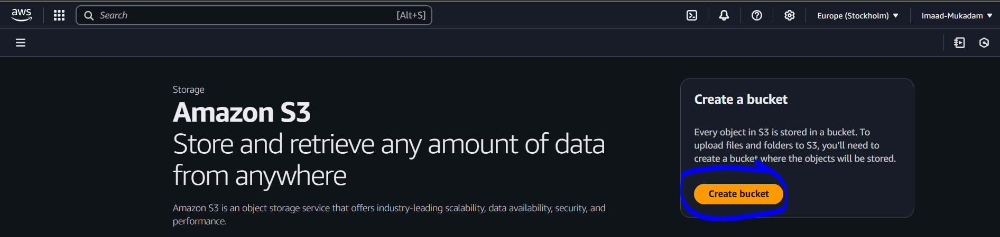

ii. Remember to give a unique name for your S3 bucket

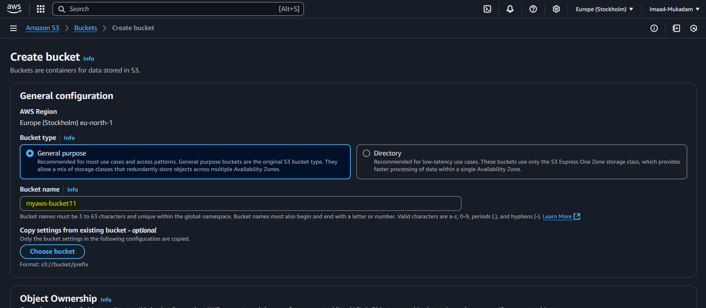

iii. Remove block public access and enable Bucket versioning to get the versions of our files, then create the bucket

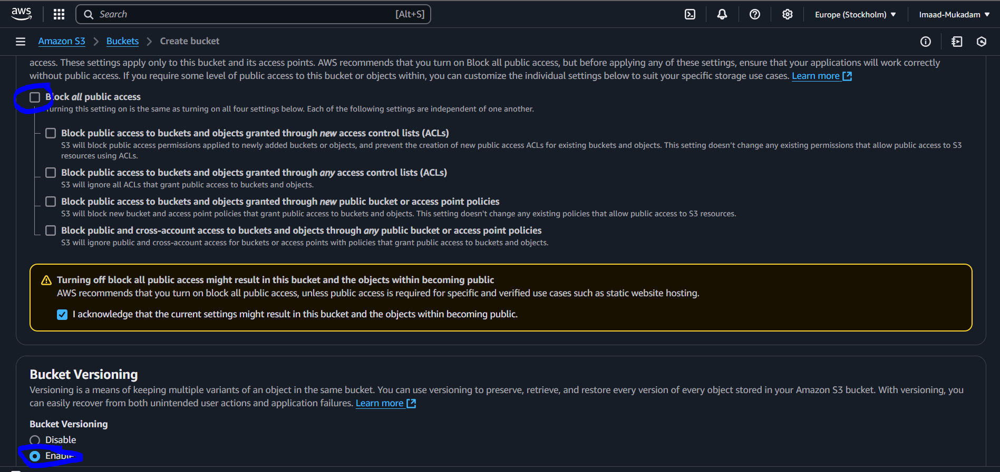

iv. Now lets upload our static website on bucket

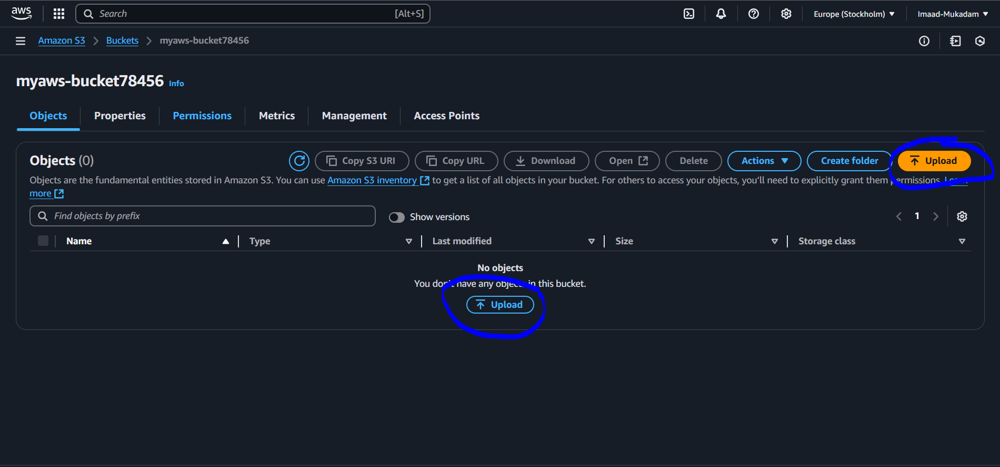

v. Click on upload files or drag and drop your files 

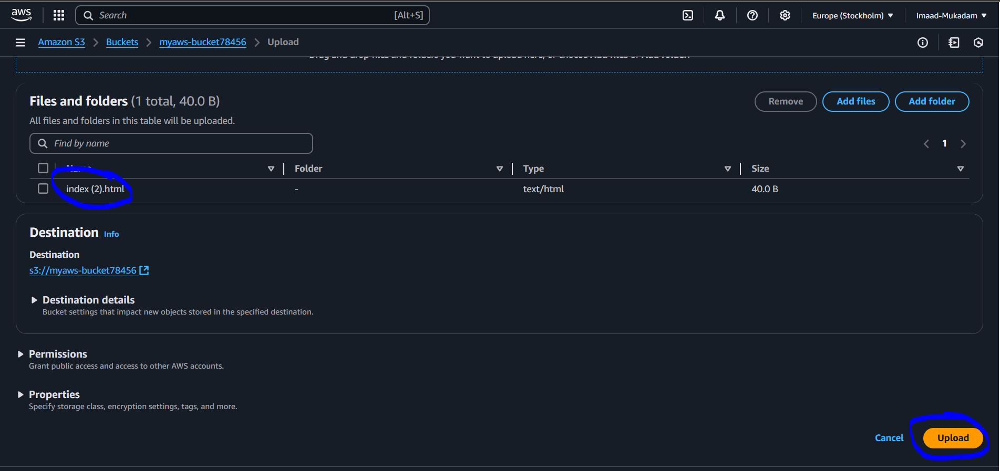

vi. Now click on your uploaded file

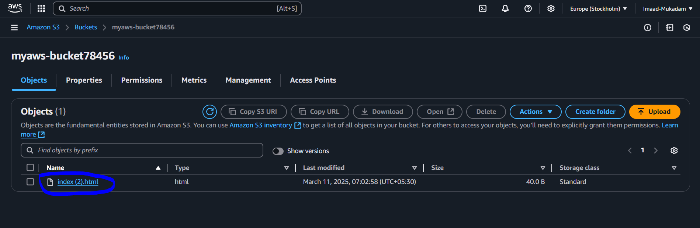

vii. Now click on Open

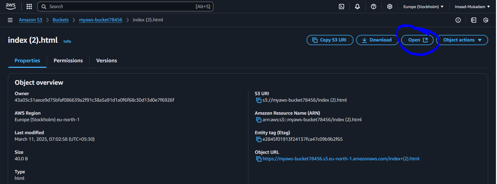

viii. You can see your dummy website is running

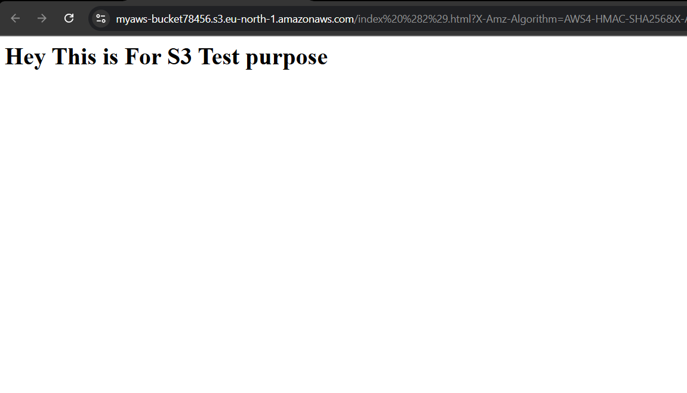


# Step - 2

i. To see the versioning , Edit your website

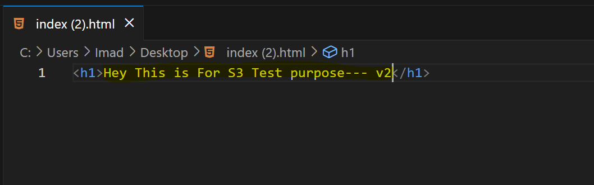

ii. Then again upload your file , then on the show versions button

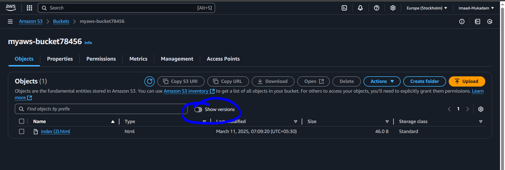

iii. You can see versions of your files

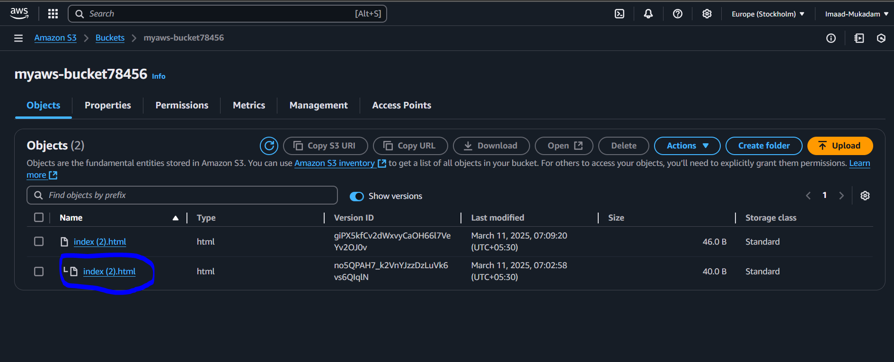

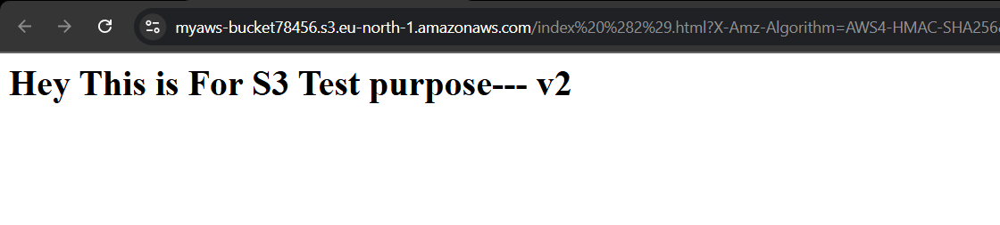

